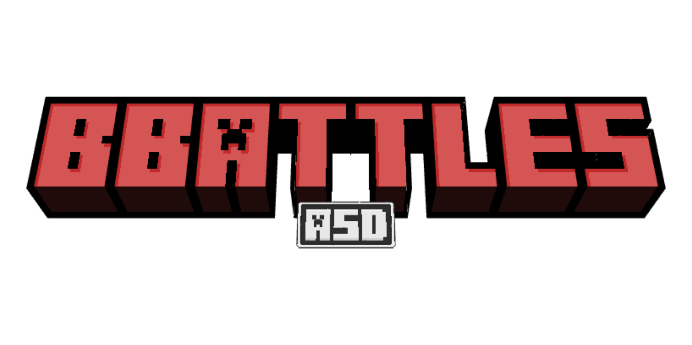
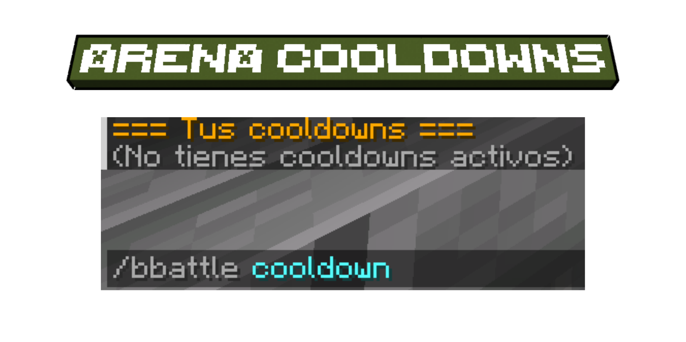
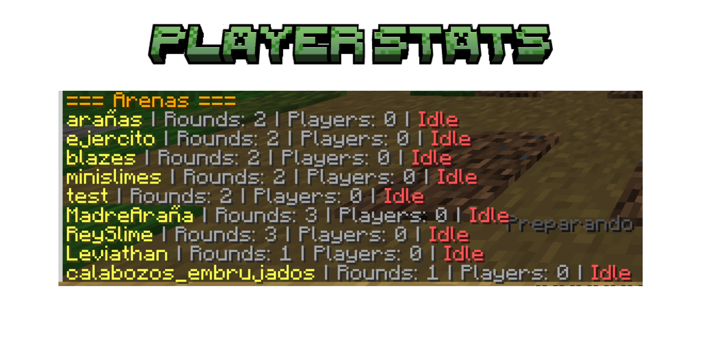
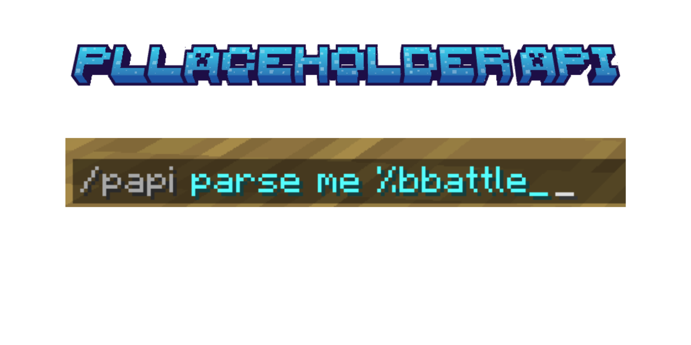
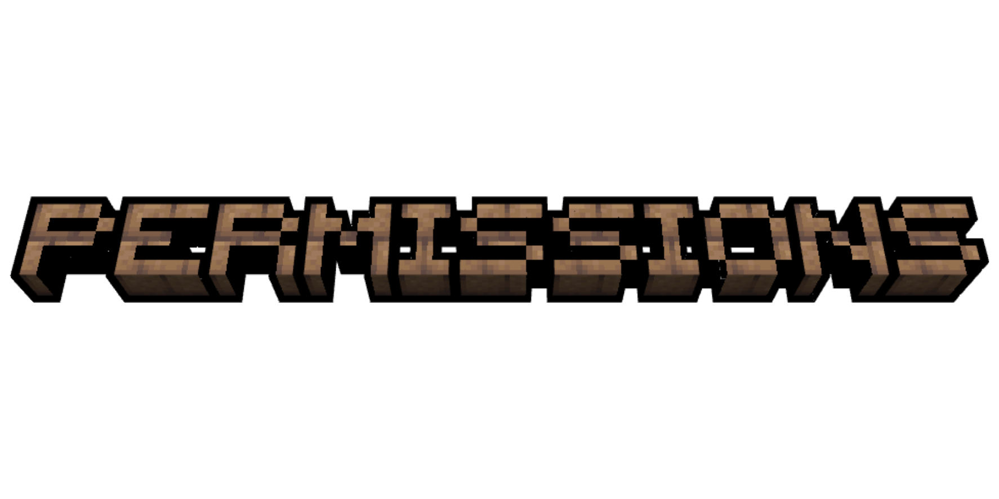
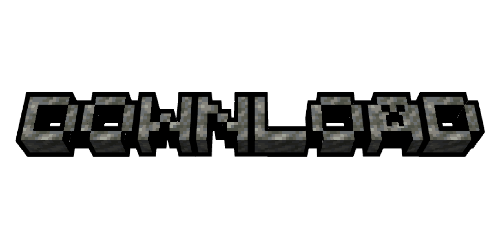

<p align="center">
  
</p>

<h1 align="center">BBattleASD</h1>

<p align="center">
  Advanced BossBattle Infrastructure • Arena Framework • MythicMobs Integration
</p>

<p align="center">
  
</p>

<p align="center">
  
  
  
  
</p>

<p align="center">
  
  
  
</p>

---

<p align="center">
  
</p>

<p align="center">
  
</p>

BBattleASD is a large-scale arena infrastructure plugin focused on creating cinematic, progression-based and highly configurable boss battle experiences.

The plugin was designed to support:
-  Vanilla boss arenas
-  MythicMobs integrations
-  Round-based combat
-  Progression systems
-  Unlockable arenas
-  Cinematic gameplay

Unlike traditional arena plugins, BBattleASD was designed as a complete boss progression infrastructure capable of powering entire RPG and prison combat ecosystems.

---

<p align="center">
  
</p>

<p align="center">
  
</p>

```txt
/bbattle
/bbattle crear
/bbattle editar
/bbattle remove
/bbattle reload
/bbattle join
/bbattle leave
/bbattle spectate

/villas
```

<details>
<summary>

View Detailed Command Infrastructure
</summary>

<br>

The command architecture inside BBattleASD was designed to centralize arena management into a modern GUI-driven workflow.

Instead of relying on configuration files for every arena modification, almost every system can be configured directly in-game.

###  Arena Administration

Administrators can:
- create arenas
- edit rounds
- configure rewards
- modify mobs
- manage cooldowns
- configure unlocks
- synchronize spectator systems
- configure battle behavior

without requiring server restarts.

###  Independent Arena Ecosystem

Every arena behaves independently, allowing:
- different bosses
- different rounds
- different rewards
- unique progression
- custom cooldowns
- unique unlock requirements

for every battle.

</details>

---

<p align="center">
  
</p>

<p align="center">
  
</p>

<details>
<summary>

View Detailed Arena System
</summary>

<br>

BBattleASD was designed around the concept of progression-driven combat arenas.

Each arena behaves as its own independent combat infrastructure with unique:
- rules
- rounds
- bosses
- unlocks
- rewards
- progression flow

### <span style="color:#FF5C5C"><b>Progression-Oriented Gameplay</b></span>

Possible implementations:
- Easy → Normal → Hard → Extreme
- Story progression
- RPG dungeon scaling
- Prison combat progression
- Raid systems
- Seasonal events

###  Cinematic Combat

The plugin was specifically designed to create:
- intense battles
- coordinated rounds
- large-scale boss fights
- visual immersion
- progression tension

instead of basic mob waves.

</details>

---

<p align="center">
  
</p>

<p align="center">
  
</p>

<details>
<summary>

View Detailed Villas System
</summary>

<br>

BBattleASD includes an independent arena browsing system through `/villas`.

This system allows servers to separate:
- special arenas
- thematic zones
- progression hubs
- event battles
- cinematic locations

from the standard battle menu.

###  Immersive Presentation

The objective of the Villas system is improving immersion by making combat progression feel connected to the world itself rather than disconnected menus.

</details>

---

<p align="center">
  
</p>

<p align="center">
  
</p>

<p align="center">
  
</p>

<details>
<summary>

View Detailed Arena Editor
</summary>

<br>

The Arena Editor is one of the core systems inside BBattleASD.

It was designed to allow complete arena configuration without touching configuration files.

###  Configurable Systems

Arena settings include:
- minimum players
- maximum players
- join countdowns
- cooldown systems
- spectator locations
- battle duration
- inventory restoration
- shield restrictions
- arena boundaries

### <span style="color:#FF5C5C"><b>Scalable Arena Design</b></span>

Because every arena behaves independently, servers can create:
- solo bosses
- co-op raids
- prison PvE progression
- multi-stage encounters
- event-based battles

inside the same infrastructure.

</details>

---

<p align="center">
  
</p>

<p align="center">
  
</p>

<details>
<summary>

View Detailed Round System
</summary>

<br>

Every arena inside BBattleASD can contain multiple combat rounds.

Rounds are fully independent and support:
- unique mobs
- different spawn points
- boss phases
- progression scaling
- pacing control

###  Boss Phases

Possible implementations:
- introductory waves
- mini-boss phases
- transition fights
- support enemies
- final boss encounters
- enraged phases

creating cinematic combat progression.

</details>

---

<p align="center">
  
</p>

<p align="center">
  
</p>

<p align="center">
  
</p>

<details>
<summary>

View Detailed Mob Editor
</summary>

<br>

The Mob Editor is one of the most advanced systems inside BBattleASD.

Every combat entity can be individually customized through GUI systems.

###  Configurable Mob Statistics

Each mob can independently configure:
- health
- damage
- movement speed
- armor
- resistance
- follow range
- knockback
- drops
- equipment
- age
- visibility
- boss behavior

###  MythicMobs Integration

Supports:
- vanilla mobs
- MythicMobs bosses
- custom RPG entities
- phase systems
- advanced combat AI

allowing extremely complex encounters.

</details>

---

<p align="center">
  
</p>

<p align="center">
  
</p>

<details>
<summary>

View Detailed Spawn System
</summary>

<br>

BBattleASD includes a complete spawnpoint infrastructure allowing every mob to spawn in specific locations for each round.

###  Dynamic Combat Placement

This allows:
- tactical positioning
- cinematic entrances
- boss phase transitions
- coordinated mob waves
- multi-zone encounters

instead of random entity spawning.

</details>

---

<p align="center">
  
</p>

<p align="center">
  
</p>

<p align="center">
  
</p>

<details>
<summary>

View Detailed Reward System
</summary>

<br>

The reward infrastructure inside BBattleASD was designed to support long-term combat progression.

###  Reward Possibilities

Rewards can include:
- custom items
- commands
- currencies
- keys
- permissions
- progression unlocks
- event materials

### <span style="color:#FF5C5C"><b>Arena Unlock Progression</b></span>

One of the core mechanics inside the plugin is arena progression.

Possible flow:
```txt
Easy Arena
↓
Normal Arena
↓
Hard Arena
↓
Extreme Arena
```

This allows servers to build full RPG progression systems around boss encounters.

</details>

---

<p align="center">
  
</p>

<p align="center">
  
</p>

<details>
<summary>

View Detailed Cooldown System
</summary>

<br>

BBattleASD supports independent cooldown systems for every arena.

This allows servers to:
- limit boss farming
- control progression pacing
- synchronize events
- protect economies
- create timed progression loops

Cooldowns can be managed per player and per arena independently.

</details>

---

<p align="center">
  
</p>

<p align="center">
  
</p>

<details>
<summary>

View Detailed Spectator System
</summary>

<br>

BBattleASD includes a dedicated spectator infrastructure allowing players to observe active battles safely.

Features:
- spectator warps
- protected spectating
- isolated viewers
- cinematic observation
- live arena monitoring

This system was designed to improve immersion and community interaction during large-scale boss encounters.

</details>

---

<p align="center">
  
</p>

<p align="center">
  
</p>

<details>
<summary>

View Detailed Battle Flow
</summary>

<br>

The combat flow inside BBattleASD was designed to feel cinematic and progression-driven.

Battle infrastructure includes:
- countdowns
- bossbars
- round transitions
- victory handling
- defeat handling
- arena cleanup
- reward delays
- spectator synchronization

The objective was creating encounters that feel memorable instead of repetitive mob grinders.

</details>

---

<p align="center">
  
</p>

<p align="center">
  
</p>

<p align="center">
  
</p>

<details>
<summary>

View Detailed Statistics System
</summary>

<br>

BBattleASD tracks combat progression through a complete statistics infrastructure.

Tracked statistics include:
- victories
- defeats
- kills
- deaths
- arena progress
- rankings

###  PlaceholderAPI Support

Includes placeholders such as:
```txt
%bbattle_victorias_<arena>%
%bbattle_derrotas_<arena>%
%bbattle_mobsmatados_<arena>%
%bbattle_top<N>_nick_victorias_<arena>%
```

allowing:
- holograms
- scoreboards
- menus
- rankings
- progression displays

</details>

---

<p align="center">
  
</p>

#  PERMISSIONS

```txt
bbattle.use
bbattle.admin
bbattle.join.<arena>
bbattle.spectate.<arena>
bbattle.reload
```

---

<p align="center">
  
</p>

#  DOWNLOAD

BBattleASD is distributed only as a compiled `.jar`.

The source code remains private because this plugin was developed exclusively for my own Minecraft infrastructure and gameplay ecosystem.

<p align="center">
  <a href="https://github.com/ItsAsddd/BBattleASD/releases">
    
  </a>
</p>

---

```txt
Minecraft Version: 1.21.4
Server Software: Paper
Dependencies: MythicMobs (Optional), PlaceholderAPI (Optional)
Project Type: Personal / Private Infrastructure
Source Code: Private
Public Usage: Showcase only
```

<p align="center">
  
  
  
</p>
